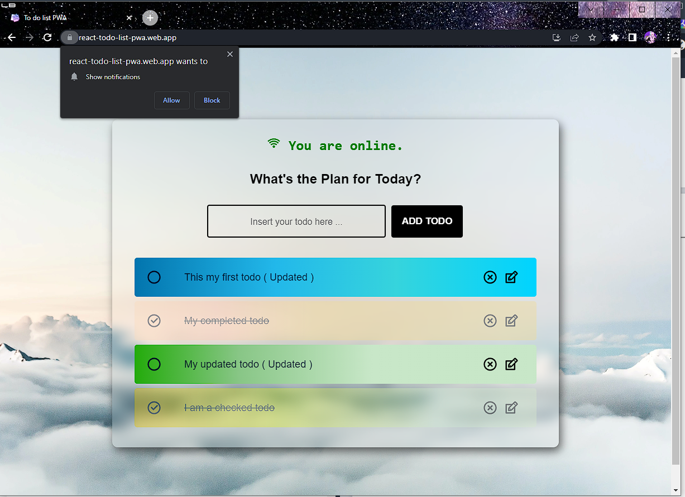

to dos :

- Increase performance score (now 96 lighthouse).

- finish setting up notifications with FCM notifications (add background notification) (network status component)

- fix auto input select in mobile pwa. 

### run npm run build && serve build -s for service worker support .

# Actual Screenshots of the Todo List Pwa .

- Desktop online view :
  

- Desktop offline view :
  
